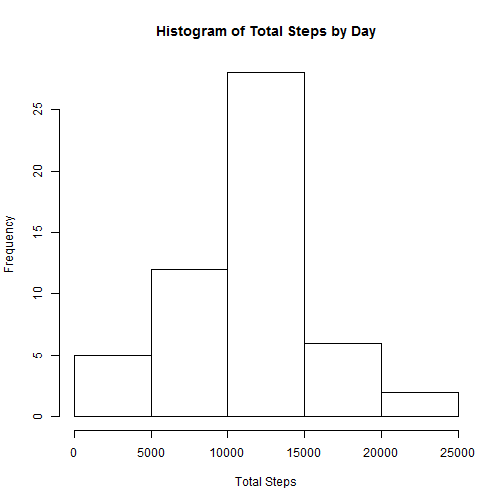
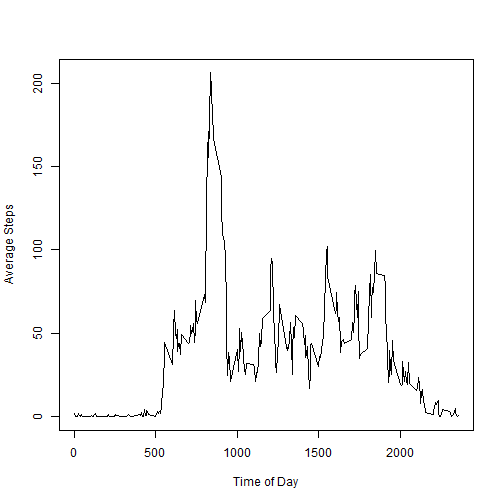
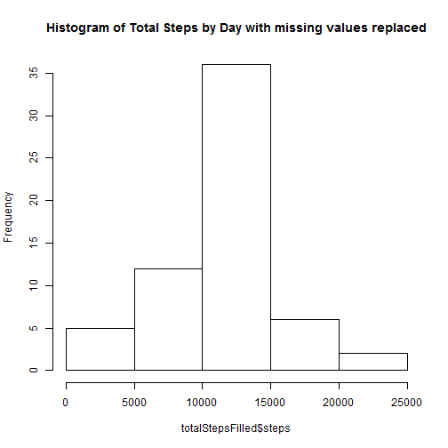
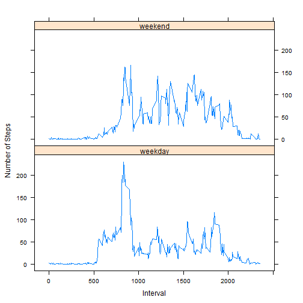

## Loading and preprocessing the data

```r
## unzip and load the activity file
activity <- read.csv(unz("activity.zip", "activity.csv"), header=TRUE)
```

## What is mean total number of steps taken per day?

```r
## calculate the total number of steps per day
totalSteps <- aggregate (activity$steps ~ activity$date, FUN=sum)
colnames(totalSteps) <- c("date", "steps")
```

### Histogram of total steps by day

```r
## display the histogram of total number of steps per day
hist(totalSteps$steps, main="Histogram of Total Steps by Day", xlab="Total Steps")
```

 

### Mean of total steps by day

```r
mean (totalSteps$steps)
```

```
## [1] 10766.19
```

### Median of total steps by day

```r
median(totalSteps$steps)
```

```
## [1] 10765
```

## What is the average daily activity pattern?

```r
## calculate the average per period
averageStepsByPeriod <- aggregate (activity$steps ~ activity$interval, FUN=mean)
colnames(averageStepsByPeriod) <- c("interval", "steps")
plot(averageStepsByPeriod$interval, averageStepsByPeriod$steps, type="l", xlab="Time of Day", ylab="Average Steps")
```

 

### Which 5-minute interval, on average across all the days in the dataset, contains the maximum number of steps?

```r
maxInterval <- averageStepsByPeriod[averageStepsByPeriod$steps == max(averageStepsByPeriod$steps),]
maxInterval$interval
```

```
## [1] 835
```

## Imputing Missing Values

### total number of missing values in the dataset

```r
sum(is.na(activity$steps))
```

```
## [1] 2304
```

### fill in missing values with mean for that interval


```r
## assign interval mean to missing values 
activityFilled <- merge(activity, averageStepsByPeriod, all.x = TRUE, by.x="interval", by.y="interval")
## set all NA values to mean
activityFilled$steps[is.na(activityFilled$steps.x)] <- activityFilled$steps.y[is.na(activityFilled$steps.x)]
## set all remaining values to measured values
activityFilled$steps[is.na(activityFilled$steps)] <- activityFilled$steps.x[is.na(activityFilled$steps)]
## remove old columns
activityFilled$steps.x <- NULL
activityFilled$steps.y <- NULL
```

### Total number of steps per day with NAs replaced

```r
## aggregate the steps by date
totalStepsFilled <- aggregate(activityFilled$steps ~ activityFilled$date, FUN=sum)
colnames(totalStepsFilled) <- c("date", "steps")

## display the histogram of total number of steps per day
hist(totalStepsFilled$steps, main="Histogram of Total Steps by Day with missing values replaced")
```

 

### Mean of total steps by day with missing values replaced

```r
mean (totalStepsFilled$steps)
```

```
## [1] 10766.19
```

### Median of total steps by day with missing values replaced

```r
median(totalStepsFilled$steps)
```

```
## [1] 10766.19
```
### Observation: The mean is identical, but the median has shifted to the mean.

## Are there differences in activity patterns between weekdays and weekends?


```r
activityFilled$dateType <- as.Date(activityFilled$date, "%Y-%m-%d")
activityFilled$weekday <- weekdays(activityFilled$dateType)
activityFilled$weekday[which(activityFilled$weekday == "Sunday" | activityFilled$weekday =="Saturday")] = "weekend" 
activityFilled$weekday[which(activityFilled$weekday != "weekend")] = "weekday" 
activityFilled$weekday <- as.factor(activityFilled$weekday)
averageStepsPerPeriodFilled <- aggregate(activityFilled$steps ~ activityFilled$interval+activityFilled$weekday, FUN=mean)
colnames(averageStepsPerPeriodFilled) <- c("interval", "weekday", "steps")
library(lattice)
xyplot(averageStepsPerPeriodFilled$steps~averageStepsPerPeriodFilled$interval|averageStepsPerPeriodFilled$weekday, type="l", xlab="Interval", ylab="Number of Steps", layout=c(1,2,1))
```

 

Visual inspection indicates that the activity is similar, but shifted later in time, over the weekends.
